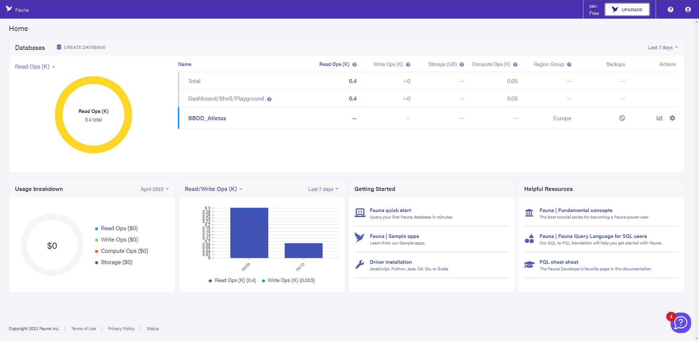
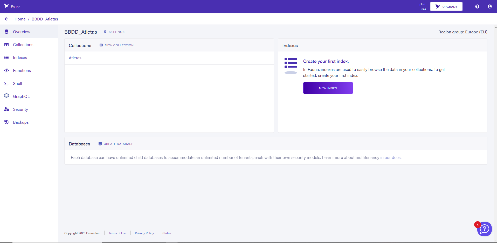
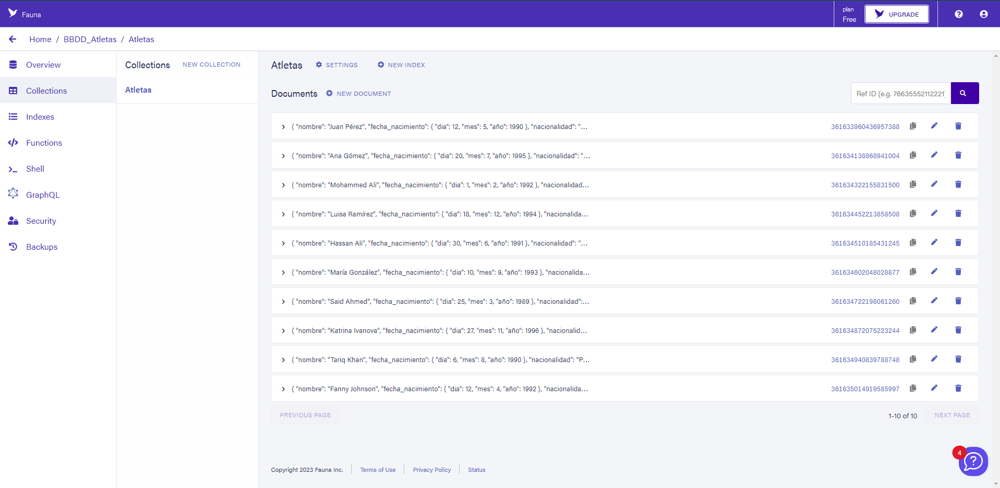

# *Plantilla Práctica Microservicios*: descripción de la aplicación

## Datos del alumno
### Emilio Martínez Conchillo
Alumno de Ingeniería Informática de la Universidad de Jaén.
* **Correo:** emc00073@red.ujaen.es
* **Nombre usuario GitHub:** emc00073
* **URL del perfil:** https://github.com/emc00073
* **Tablero de Trello:** https://trello.com/b/HzkqYw14/pr%C3%A1ctica-2-da

## Incremento 1
Para este incremento, crearé y configuraré la base de datos y realizaré las HU 1, 2 y 4. He elegido estas porque son las iniciales y me servirán como toma de contacto con el proyecto.

### Base de datos

 

### Tablero de trello al inicio

### HU - 01
Esta HU no ha sido difícil, símplemente cambiar los datos en ms-plantilla/callbacks.

### HU - 02
Para esta HU he tenido que vincular la base de datos y hacer unos cuantos métodos que recuperen los documentos y forme una tabla con ellos. Además de un botón Listar Atletas que desencadene esta función.

### HU - 04
Para mostrar el resto de campos, he creado más columnas en la cabecera y añadido sus datos en el cuerpo de la tabla.

### Tablero de trello al final
Todas las HU hechas

## Incremento 2
Para este incremento, realizaré las HU 3, 5 y 6. Las elegí porque ya tengo la tabla construida del incremento anterior y "simplemente" tengo que ordenar la tabla según el campo elegido y añadir la opción de mostrar al final.

### Tablero de trello al inicio

### HU - 03
La primera historia de usuario en realizar fue la 3 (ordenar la columna nombre). Para esto he tenido que crear un método nuevo: imprimeOrdenadoNombre. Este método se encarga de recuperar de la base de datos los atletas, ordenarla en orden alfabético y construir la nueva tabla con el vector de atletas ordenado. 

También hago uso de un atributo ascendente_nombre que indica el sentido del orden. Esta función se llama clickando sobre la cabecera de la columna.

Aquí podemos ver la columna ordenada en sentido ascendente:

 

Y aquí en sentido descendente:

### HU - 05
Para la HU número 5, he replicado lo que he hecho en la 3, haciendo un método del tipo: ImprimeOrdenado"Atributo" para cada atributo y una variable para el sentido de su ordenación. Según si el elemento a ordenar era texto, fecha o una serie de números, he tenido que modificar la línea de código que llama a la función sort.

Aquí unos ejemplos de como queda:

Fecha:
 

Nacionalidad:
 

Mundiales en los que ha participado:
 

Años de esos mundiales:

Todos los campos se pueden ordenar en ambos sentidos pero con el fin de agilizar el read.me, no he incluido campturas de todos.

### HU - 06
Para esta HU he tenido que añadir:
* Una nueva dirección al fichero routes de la carpeta ms-plantilla y su respectiva funcionalidad en callbacks que recupera un único atleta de la base de datos dado el id
* Permitir CORS entre el API-Gateway y ms-plantilla
* Añadir el botón en la tabla
* Un método recuperaUnAtleta al que se le pasa un ID, llama a la nueva ruta con el parámetro ID y monta una tabla solo con él.

Un ejemplo de como queda en el front-end:

 

### Tablero de trello al final

## Incremento 3
Para este incremento, realizaré las HU 8, 9 y 12. Las elegí porque no tengo que implementar algo muy complicado en las dos primeras y la 12 por descarte.

### Tablero de trello al inicio

### HU - 08
La primera historia de usuario en realizar fue la 8 (buscar atletas por su nombre). Para esto he tenido que crear un método nuevo: buscar; y un botón en lo alto de la tabla por el que se le pasará la palabra a buscar. Este método se encarga de recuperar de la base de datos los atletas, filtrarlos y mostrarlos en una tabla.

También hago uso de un atributo ascendente_nombre que indica el sentido del orden. Esta función se llama clickando sobre la cabecera de la columna.

Aquí vemos el funcionamiento:

 

